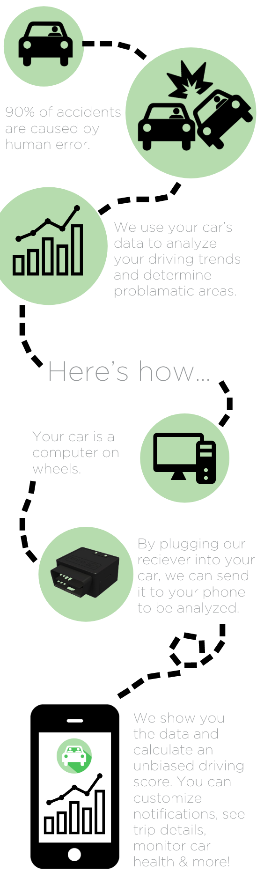
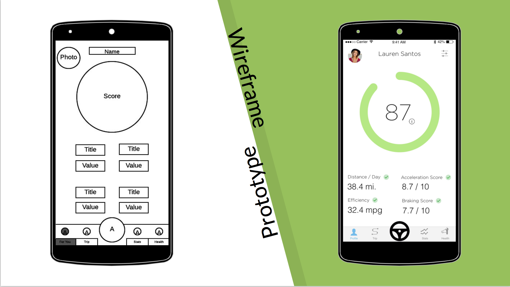
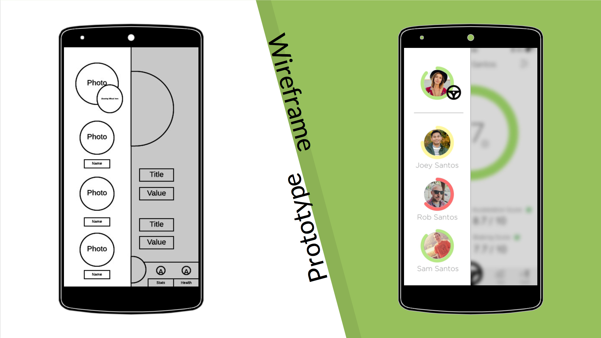
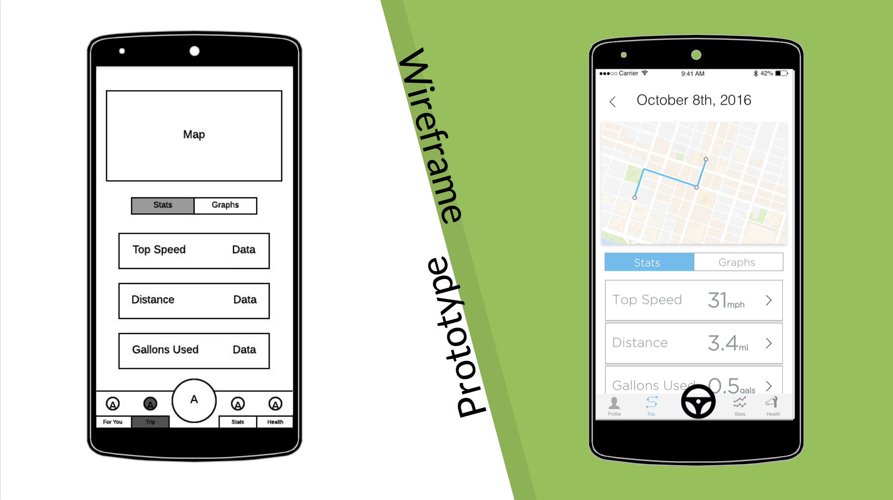
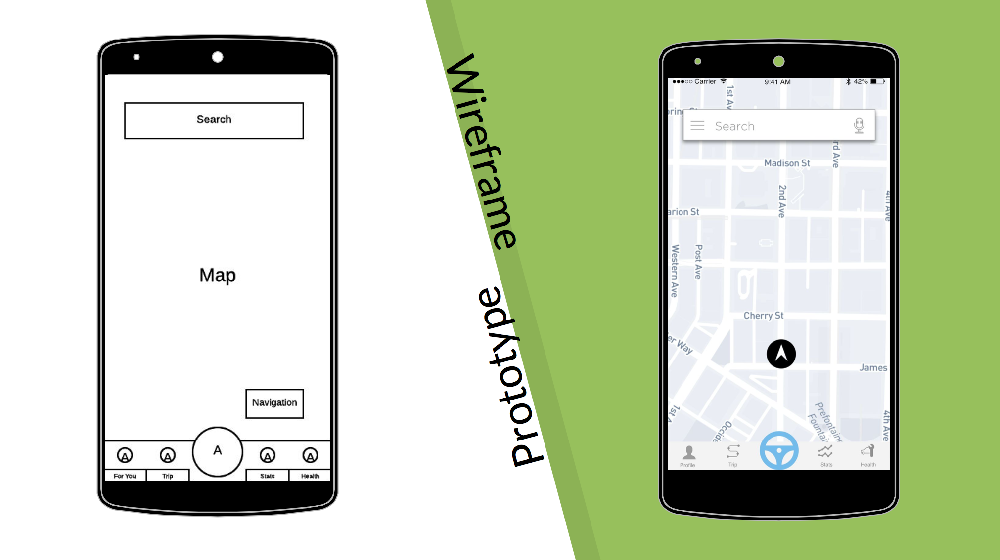
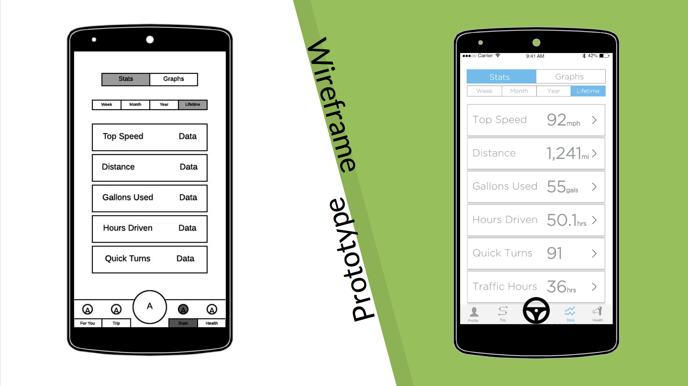
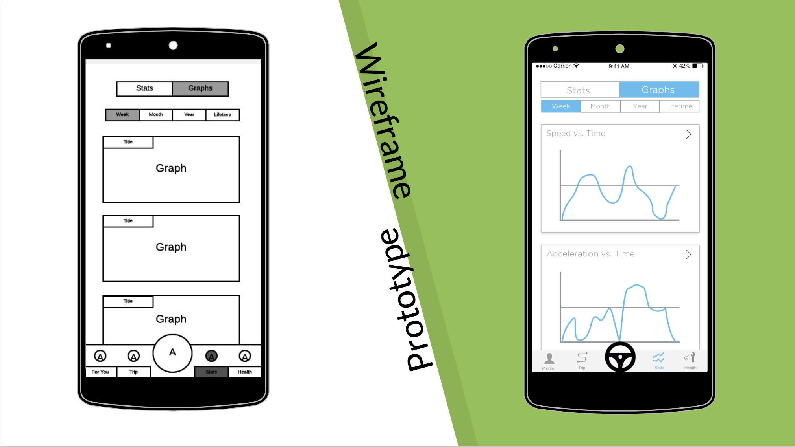
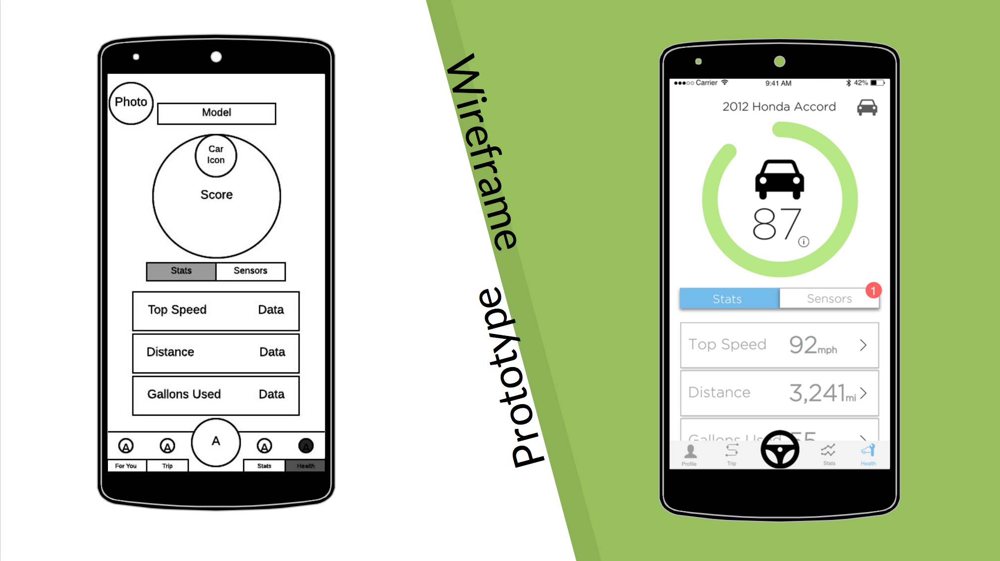
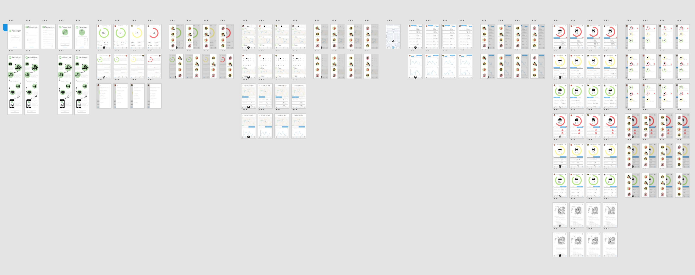
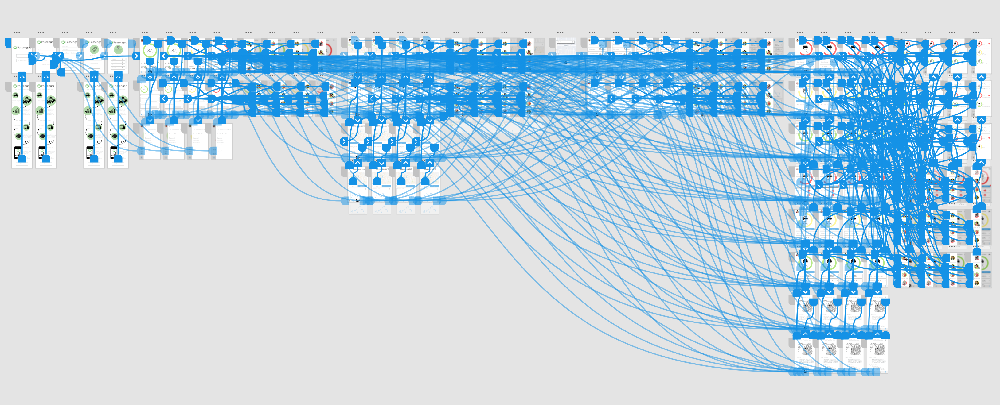

# Passenger

Repository for Passenger, application design and prototyping for Info 200 Final Project (Winter 2016-17). Includes all stages of design process from proposal to final prototype.

Awarded best UX design out of approximately 30 teams for Info 200 section B with Dr. Stearns.

### Final : https://xd.adobe.com/view/33b7345f-4859-432b-bc3d-d8dd5f217b4e/

## Project Description

"The term 'information resource' is intentionally broad and vague. The only requirement is that it utilizes some form of technology (in the broad sense) to connect people with the information they need. It could be something as simple as a poster or pamphlet that clearly and elegantly informs a target group of people. Or it could be something artistic like a short movie or graphic novel. Or it could be something software-based, like a new interactive application that enables people to communicate, locate, share, or organize information in some way. It could even involve new hardware such as virtual/mixed reality, or some new custom device of your own design."

## Project Details

From initial proposal to final prototype and presentation, the project was completed in approximately 5 weeks. The goal of Passenger was to target motor vehicle accidents, one of the leading causes of death in America, and produce a feasible product for market.

###### Problem Area

According to studies performed by the CDC or Centers for Disease Control and Prevention, teenage drivers between the ages of 16 and 19 years-old are at the highest risk of being in a fatal crash.  In 2014 alone, 2,270 drivers between the age of 16-19 were killed while 221,313 required medical treatment after suffering a car crash.  This equates to approximately 6 teen drivers’ deaths each day in the United States.  In all, motor vehicle fatalities account for one third of the deaths to teenagers and the leading cause of accidental deaths.

###### Target User

Passenger targets newly licensed drivers, specifically teenager drivers, to create better driving habits and attempt to reduce the number of fatalities and accidents which occur each year.

## Project Proposal

"A 'digital driving profile' created by the collection and analysis of the data produced by a vehicle.

To allow the “digital driving profiles” to be accessible to third parties (Parents, Employers, etc) to provide oversight on an individual’s driving tendencies."

The Passenger application would work in conjunction with an external adapter that connects directly to the OBD-II port found on all modern cars. The adapter listens to the data transmitted from the car and transmits it via Bluetooth to the user's phone. Passenger analyzes the data it receives and creates a driving profile for the driver. The profile displays various details about the driver's behavior behind the wheel from maximum speed to braking pressure. The drivers profile can additionally be shared and monitored by a overseeing individual such as the driver's parent or employer for greater oversight.

## Wireframes and Prototypes

Initial Mockups and Final Prototypes.

*** Primary Profile Page of the users. Displays immediate information about their driving behavior and a score generated by an accumulation of their data. ***

*** Multi-User profile option for linked accounts. Primary use cause includes a parent monitoring their family driving habits to ensure their diligence on the road.***

*** Trip based statics. Allows the user the option to view details about their driving behavior each trip.***

*** Wireframe and prototype of the application's built in GPS navigation system that provides directions based on the 'safest' roads.***

*** Statistics screen displays overall statistics about the driver's behavior in various time frames.***

*** Statistics screen displays overall statistics in graph format about the driver's behavior in various time frames.***

*** Car health monitoring via the data received from the external adapter. Includes monitoring for oil, tire pressure, and engine health.***

## Final Prototype

https://xd.adobe.com/view/33b7345f-4859-432b-bc3d-d8dd5f217b4e/

*** 126 Screens***

### Screen Mappings

## Team Members

Project Lead: Matthew Li

Team Members:
Luke Allen, Fherna Caoili, and Yilan Pan
